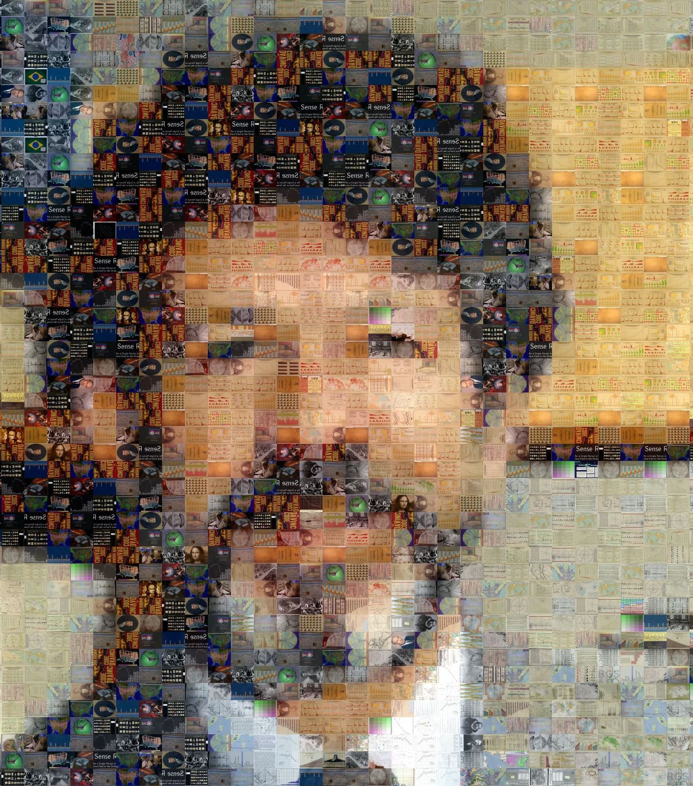

## Instructor

* ⚡ Michael Friendly [datavis.ca home page](http://datavis.ca)
* 📫 Email: friendly AT yorku DOT ca
* 𝕏 Twitter: [@datavisFriendly](http://twitter.com/datavisFriendly); [#psy6135](https://twitter.com/search?q=%23psy6135) 
* 🦋 BlueSky: [@datavisfriendly.bsky.social](https://bsky.app/profile/datavisfriendly.bsky.social) Where I mostly am these days.
* Office: 226 BSB
* Phone: ~~x66249~~
* 💬 Office hour: Wednesday: 11:30-12:30, but by appointment and mostly via [Zoom](https://yorku.zoom.us/my/friendly).
* Course web site: [https://friendly.github.io/6135/](https://friendly.github.io/6135/)
<!--
* TAs: 
  + Nataly Beribisky <natalyb1 AR yorku DOT ca>
  + Justeena Zaki-Azat <justeena AT yorku DOT ca>
-->

<!-- ```{r, out.width = "400px"} -->
<!-- knitr::include_graphics("images/MichaelFriendly-Mosaic-50pct-cropped.jpg") -->
<!-- ``` -->

* Photo mosaic of me (composed of images from the history of data vis); click on the image for a larger version

<a href="images/perception/MichaelFriendly-Mosaic-50pct-cropped.jpg"></a>

## Class meetings {#meetings}

* Thu., 2:30 pm - 5:30 pm, [207 Behavioural Science Building](https://maps.info.yorku.ca/2010/06/behavioural-science/).
* A few lab sessions may be held in the Hebb Computer lab, 159 BSB, but you're advised to bring a laptop to class.


<!--
## Class discussion forum

This term we will be using eClass for class discussion. The system is designed to make it
easier to communicate with your classmates, the TA, and myself.
Rather than emailing questions to a listserv or to us individually, 
I encourage you to post your questions on eClass. 

Students in the course are automatically subscribed.
The link is: https://eclass.yorku.ca/eclass/user/index.php?id=37950
-->


## Course Description {#description}

### Summary

This course is designed as a lecture/seminar dealing with data visualization from a largely psychological and historical perspective. 

### Full description
Information visualization is the pictorial representation of data. 

* Successful visualizations capitalize on our capacity to recognize and understand patterns presented in information displays. 
* Conversely, they require that writers of scientific papers, software designers and other providers of visual displays understand what works and what does not work to convey their message. 

This course will examine a variety of issues related to data visualization from a largely psychological perspective, but will also touch upon other related communities of research and practice related to this topic:

* history of data visualization, 
* computer science and statistical software,
* visual design, 
* human factors. 

We will consider visualization methods for a wide range of types of data from the points of view of both the viewer and designer/producer of graphic displays. 

## Evaluation {#evaluation}
<!--

The description below reflects the course when it was last taught in 2023.
The components and weights for evaluation are still being considered, but are likely to remain the same.
-->

Grades will be based on the following components:

### Discussion leader (20%)
Each session, I ask that 1-2 of you will serve as discussion leader for a brief discussion on one of the readings, sub-topics or an application related
to the topic. (~ 5 min.).  I will circulate a sign-up sheet for this in the first class.

* It may be helpful to prepare a one-page handout, or your slides, or or other visual materials. 
* You can send these to the [class listserv](mailto:psyc6135@yorku.ca).

    <!-- post these on [eClass](https://eclass.yorku.ca/eclass/user/index.php?id=37950)  -->
    <!-- + With your permission, I will post these to the [students page](students.html) -->


### Class presentation (40%) {#presentation} 
  In the last week or two, each person will give a ~ 20-25 min presentation on a topic of research, application, or software related to data visualization. The topic is not restricted to things covered in the lectures. You'll find a few random suggested topics on the [Resources page](resources.html), but you can also get a sense of the range and scope of projects from
  those listed on the [Students page](students.html)
  <!-- You are permitted to do this work with one other person. -->

* You should prepare a brief **topic proposal** and send it to me by email by the end of Reading Week, Feb. 21.
    <!-- post it to eClass or discuss it with one of us by email by Jun 1. -->
    This is ungraded, but intended to help you shape your topic.

* Your in-class presentation should be accompanied by a slide show or other visual materials. It would be best to
    post your presentation materials _in advance_, preferably by a link to cloud storage or as an email attachment to
    the [class listserv](mailto:psyc6135@yorku.ca).
    <!-- We encourage students to prepare -->
    <!-- and record an audio/video of your presentation _in advance_ and upload to eClass or share a link.  -->
    <!-- We would prefer to do this offline, in advance --- meaning you can record an audio/video of your presentation in advance and upload to eClass or share a link. In class discussion can then be abbreviated. -->
    <!-- Those who do post their presentation in advance will be given extra credit. -->
    
* Evaluation of the presentation will be done by peer review as well as by the instructor. An online rating form will provided.


### Research proposal (40%) {#proposal}
  Prepare a brief research paper/proposal (normally ~ 6-9 pages) on a data visualization topic. This can be: 
  
  + a proposal for an empirical study of some aspect of data visualization, 
  + an application of visualization methods to a substantative topic, 
  + an historical review, or 
  + a something leading to the development or implementation of a graphical method. 
  
  The topic should not be identical to that of your presentation and should not be just a repetition of
  work you've done for other courses.
  <!-- You are permitted to do this work with one other person.  -->
  This will be due at the end of the exam period, ~ April 25.
  
  **Format**: Whatever you do, please _don't use strict APA format_ (double-spaced, figures at the end) --- meant for copy editors, not for readers. (I hate it so much, I refuse to review journal papers in this format.)
  
  - Single-spaced is fine, with figures inline, or even a two-column format as in a conference paper. For example, 
    + the IEEE VIZ conference provides [a two-column example](students/tvcg-journal-word/template_journal_word_no_teaser.pdf) with this [Word template](students/tvcg-journal-word/template_journal_word_no_teaser.docx). 
    + there is also an [example with a teaser image](students/tvcg-journal-word/template_journal_word_teaser.pdf), a sort of graphical abstract, with [this template](students/tvcg-journal-word/template_journal_word_teaser.docx)
    + If you choose to write in Rmarkdown (`.Rmd`), the [rticles package](https://cran.r-project.org/package=rticles) provides a suite of custom R Markdown LaTeX formats and templates for various formats. To use one, select
    `File -> New File -> R Markdown... -> From Template` and choose something reasonable. See the [Getting Started](https://pkgs.rstudio.com/rticles/articles/rticles.html) and their [Examples of journal templates](https://pkgs.rstudio.com/rticles/articles/examples.html).
  - Word or PDF is the preferred output format, but you are free to submit something in HTML if you want to use interactivity or animation. 
  - Pay attention to the preparation of your figures and their figure captions: strive for clarity. This is a course on data visualization and communication after all.
  - **Citations & References**: I'm not that picky, but I prefer `author-year` citations like [Friendly & Claude (2025)](https://nightingaledvs.com/what-does-ai-understand-about-a-graph/) rather than a numbered list `[1]`. The reference for this would be something like:

> Friendly, M., & Claude, H. (2025). What Does AI Understand About a Graph?, _Nightingale_ [online].  https://nightingaledvs.com/what-does-ai-understand-about-a-graph/


  + In the References, please try to include URI links or DOIs where available.
  

### Re-use policy

{width="20%"}

The lecture slides, tutorials and R scripts linked here are available under a [Creative Commons Attribution-NonCommercial-ShareAlike](https://creativecommons.org/licenses/by-nc-sa/4.0/) license. They are available to everybody under the terms of this license and can be shared, but must be appropriately **attributed to me** with [links to this site](https://friendly.github.io/6135/).

All other materials, notably course videos, student presentations and support material files, should not be copied beyond your personal machines and hence are not available for redistribution.