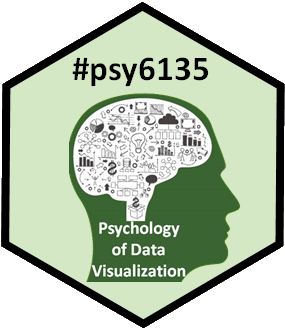
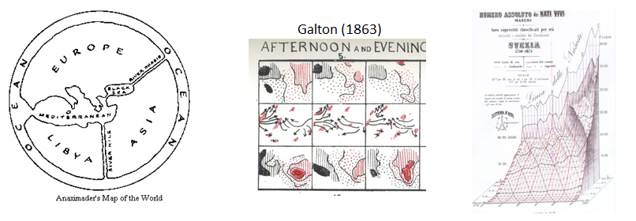
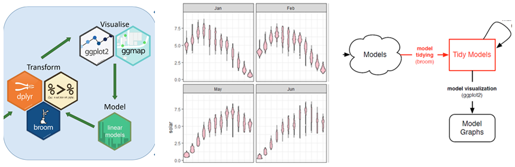
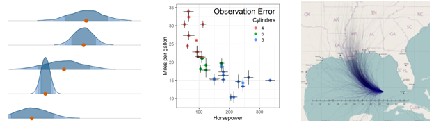

## Course Description 

 
<!-- 

 -->
Information visualization is the pictorial representation of data. 

* Successful visualizations capitalize on our capacity to recognize and understand patterns presented in information displays. 
* Conversely, they require that writers of scientific papers, software designers and other providers of visual displays understand what works and what does not work to convey their message. 

This course will examine a variety of issues related to data visualization from a largely psychological perspective, but will also touch upon other related communities of research and practice related to this topic:

* history of data visualization, 
* computer science and statistical software,
* visual design, 
* human factors. 

We will consider visualization methods for a wide range of types of data from the points of view of both the viewer and designer/producer of graphic displays. 

## Overview & Introduction

- **Lecture notes**: [1up PDF](lectures/Overview.pdf); [4up PDF](lectures/Overview-2x2.pdf)
- **Assignment**: Please prepare a 1-2 page summary of something(s) you found on the topics below. Not for grading; I'll ask a few of you to speak on this next class.

    + **Blogs**: Explore one or two of the blogs or web resources listed in the lecture notes, Readings, or in [Resources](resources.html#blogs). Find a few examples of kinds of graphs you find interesting or worth exploring more.
    + **Good/bad graphs** Explore the literature in your area, say several issues of one journal. Find one example of a data display (graph or table) that communicates particularly well, and one example of a display that communicates badly.  

#### Topics:

- Books, readings, blogs & web resources
- Goals of visualization; visualization as communication
- Roles of graphics in data analysis & presentation
- Effective data display
- Graphs: good/bad, excellent/evil

#### Readings:

- **Gelman & Unwin** [Infovis and Statistical Graphics: Different Goals, Different Looks, *JCGS* 2013](http://dx.doi.org/10.1080/10618600.2012.761137)
- Howard Wainer (1984) [How to Display Data Badly. *American Statistician* **38** 137-147](http://www.rci.rutgers.edu/~roos/Courses/grstat502/wainer.pdf)
- Jon Schwabish [The Ten Most Misleading Charts During Donald Trump’s Presidency](https://policyviz.com/2021/02/15/the-ten-most-misleading-charts-during-donald-trumps-presidency/)
- [The data visualizations that helped us understand 2020](https://uxdesign.cc/the-data-visualizations-that-helped-us-understand-2020-6447790f821)
- Check out [Additional resources for Session 1](resources.html#week1)

## Varieties of information visualization

- **Lecture notes**: [1up PDF](lectures/Varieties.pdf); [4up PDF](lectures/Varieties-2x2.pdf)
- **Assignment**:
  + From the readings that you have done so far, find one example of a data graph that
  attempts to tell an interesting story of a useful topic. How well does it succeed?
  How could it be improved?
  

#### Topics:

- Data graphs: 1D -- 3D
- Thematic maps
- Network and tree visualization
- Animation & interactive graphics

#### Readings:

- [Data Visuaization Catalog](https://datavizcatalogue.com/) A handy compendium of most known graphical methods.  There is also a [Blog](https://datavizcatalogue.com/blog/) section with extended discussions of variations of a given chart type, e.g., this one on [Boxplots](https://datavizcatalogue.com/blog/box-plot-variations/).
- [Pros and Cons of Chart Taxonomies](https://medium.com/nightingale/the-pros-and-cons-of-chart-taxonomies-5c8e094578c4). Are these chart taxonomies good or evil?
- [12 Data visualizations that illustrate poverty's biggest challenges](https://www.one.org/us/2014/05/20/12-data-visualizations-that-illustrate-povertys-biggest-challenges/)
- TED talks: [Manuel Lima, A Visual History of Human Knowledge](https://www.ted.com/talks/manuel_lima_a_visual_history_of_human_knowledge)
- TED talks: [Hans Rosling, The Best Stats ...](https://www.ted.com/talks/hans_rosling_shows_the_best_stats_you_ve_ever_seen)
- TED talks: [Nicholas Christakis, How Social networks Predict Epidemics](https://www.ted.com/talks/nicholas_christakis_how_social_networks_predict_epidemics)
- Check out [Additional resources for Session 2](resources.html#week2)

## History of data visualization

- **Lecture notes**: Overview [1up PDF](lectures/History.pdf); [4up PDF](lectures/History-2x2.pdf)
- **Lecture notes**: Golden Age [1up PDF](lectures/GoldenAge.pdf); [4up PDF](lectures/GoldenAge-2x2.pdf)

#### Topics:

- Overview: The Milestones Project
- The first statistical graph
- The Big Bang: William Playfair
- Moral statistics: the birth of social science
- Graphs in the public interest: Nightingale, Farr and Snow
- The Golden Age
- Case study: Re-Visions of Minard

#### Readings:

- **Friendly, M.** [A Brief History of Data Visualization](http://www.datavis.ca/papers/hbook.pdf)
- Friendly etal. [The First (Known) Statistical Graph: Michael Florent van Langren and the "Secret" of Longitude](http://www.datavis.ca/papers/langren-TAS09154.pdf)
- Friendly, M. [The Golden Age of Statistical Graphics. *Statistical Science*, 2008, 23, 502-535.](http://www.datavis.ca/papers/golden-STS268.pdf)
- Friendly, M. & Denis, D. [The early origins and development of the scatterplot](http://www.datavis.ca/papers/friendly-scat.pdf)
- Phan et al. [Flow Map Layout, paper](http://graphics.stanford.edu/papers/flow_map_layout/flow_map_layout.pdf); see also:
	 [Web site](http://graphics.stanford.edu/papers/flow_map_layout/)
- **Jeff Heer**, [A Brief History of Data Visualization](https://www.youtube.com/watch?v=N00g9Q9stBo), gives a lecture on his take on this   history, interpreting and extending my work from a computer science perspective.

- Check out [Additional resources for Session 3](resources.html#week3)
	
## Graphical Perception

- **Lecture notes**: [1up PDF](lectures/GraphPerception.pdf); [4up PDF](lectures/GraphPerception-2x2.pdf)

#### Topics

- Perception & Cognition
  - Encoding, decoding
  - Top-down vs. bottom-up processing
- Perceptual aspects
	- Illusions
	- Gestalt factors
	- Accuracy of decoding 

- Cognitive aspects
	- Memory
	- Color

#### Readings

- Cleveland & McGill (1984) [Graphical Perception... *JASA*](papers/ClevelandMcGill1984.pdf) A foundation paper on understanding aspects of graph perception.
- Christopher Healey [Perception in Visualization](https://www.csc2.ncsu.edu/faculty/healey/PP/) A web page on this topic, including interactive demos, animations and lots of examples
- Gordon & Finch (2015) ["Statistician Heal Thyself: Have We Lost the Plot?", *JCGS*, 1210-1229, ](http://dx.doi.org/10.1080/10618600.2014.989324)
- Zeileis etal. (2009) [Escaping RGBland: Selecting Colors for Statistical Graphics, *Computational Statistics & Data Analysis*, 53, 3259–3270.](http://epub.wu.ac.at/1692/)
- Zeileis et al. (2020) [colorspace: A Toolbox for Manipulating and Assessing Colors and Palettes](https://doi.org/10.18637/jss.v096.i01) This is the latest, definitive work on designing color palettes for R.
The associated web pages, http://colorspace.r-forge.r-project.org/index.html, have many vignettes and interactive color apps,
also online, [HCLwizard](http://hclwizard.org).
- Ware (2013), *Information Visualization: Perception for Design*, Chapter 4 (Color)
- Kennedy Elliot [39 studies abpout human perception in 30 minutes](https://medium.com/@kennelliott/39-studies-about-human-perception-in-30-minutes-4728f9e31a73)
- [Why Should Engineers and Scientists Be Worried About Color?](http://www.research.ibm.com/people/l/lloydt/color/color.HTM)
- Stephen Few [Practical Rules for Using Color in Charts](http://www.perceptualedge.com/articles/visual_business_intelligence/rules_for_using_color.pdf)
- Thomas Lin Pedersen [Scico and the Colour Conundrum](https://www.data-imaginist.com/2018/scico-and-the-colour-conundrum/)
- Check out [Additional resources for Session 4](resources.html#week4)

## Human factors research: How to tell what works

- **Lecture notes**: [1up PDF](lectures/HumanFactors.pdf); [4up PDF](lectures/HumanFactors-2x2.pdf)

#### Topics

* Human factors in graphic & information design
* Empirical study of graphs
* Experimental methods
* Accessibility of data visualization
* Graphical inference

#### Readings

- [Heer &  Bostock (2010), Crowdsourcing Graphical Perception... ](papers/Heer-Bostock-2010-MTurk-CHI.pdf)
- [Skau & Kosara (2016),  Arcs, Angles, or Areas: Individual Data Encodings in Pie and Donut Charts](https://kosara.net/papers/2016/Skau-EuroVis-2016.pdf)
- [Haroz, Kosara, & Franconeri (2015), ISOTYPE Visualization - Working Memory, Performance, and Engagement with Pictographs](http://kosara.net/papers/2015/Haroz_CHI_2015.pdf)
- [Buja et al. (2009) Statistical inference for exploratory data analysis and model diagnostics](papers/Buja-etal-2009.pdf)

## The Language of Graphs: from Bertin to GoG to ggplot2

- **Lecture notes**: [1up PDF](lectures/Language.pdf); [4up PDF](lectures/Language-2x2.pdf)
- [Deep questions of Data Visualization](lectures/DeepQuestions.pdf); [4up](lectures/DeepQuestions-2x2.pdf)

#### Topics

- Early attempts at standardization of graphs
- Bertin: Semiology of Graphics
- Graphics programming languages
- Wilkinson: The Grammar of Graphics
- Wickham: ggplot2

#### Readings

- [Palsky (1999), The debate on the standardization of statistical maps and diagrams (1857-1901)](http://journals.openedition.org/cybergeo/148)
- [Wilkinson et al (2012), The Language of Graphics, JCGS, 9(3), 530-543](http://amstat.tandfonline.com/doi/abs/10.1080/10618600.2000.10474897)
- [Wickham (2010), A layered grammar of graphics, JCGS, 19(1), 3-28](https://doi.org/10.1198/jcgs.2009.07098)
- [Kruchten (2020), Remaking Figures from Bertin's Semiology of Graphics](https://nicolas.kruchten.com/semiology_of_graphics/)
- Check out [Additional resources for Session 6](resources.html#week6)

## ggplot2: Basics

The next two sessions, devoted to developing graphs with `ggplot2` and related methods will take place
in the Hebb lab, Rm 059 BSB.

#### Lecture notes & tutorial

- [Installing R & R Studio](http://www.datavis.ca/courses/RGraphics/install_tutorial.html) You need to install
both R & R Studio to profit from this.
- [Working with R Studio](lectures/RStudio.pdf); [4up](lectures/RStudio-2x2.pdf) A mini lecture to illustrate
some aspects of R Studio
- [Introduction to ggplot2](lectures/ggplot-intro.pdf); [4up](lectures/ggplot-intro-2x2.pdf)
- **tutorial**: [ggplot2 tutorial: gapminder data](tutorials/gapminder.html); [R script for this](tutorials/gapminder.R)

#### Readings

- [getting started with ggplot](http://ggplot2.tidyverse.org/) This web page describes installing `ggplot2` and the `tidyverse` of related packages.  It also contains some useful links for learning to use `ggplot`.

- The online chapter, [Data Visualization](http://r4ds.had.co.nz/data-visualisation.html) of the book, [R for Data Science](http://r4ds.had.co.nz/) is an excellent brief introduction to `ggplot2`.  Another chapter in this book, [Graphics for Communication](http://r4ds.had.co.nz/graphics-for-communication.html) takes up some more advanced topics.

- A free online book, [An Introduction to Statistical and Data Sciences via R](https://moderndive.com/).
The focus is on the `tidyverse` of R packages for data manipulation and `ggplot2` for graphics.
Also covers data modeling (regression), hypothesis testing, etc.

## ggplot2: Going further in the tidyverse

- **Lecture notes**: [1up PDF](lectures/ggplot-further.pdf); [4up PDF](lectures/ggplot-further-2x2.pdf)
- **tutorial**: [Minard meets ggplot](tutorials/Minard.html); [R script for this](tutorials/Minard.R)

#### Topics

* Data wrangling: getting your data into shape
* Visualizing models: broom
* ggplot2 extensions
* tables in R

#### Readings

* Hadley Wickham. [Tidy data](https://www.jstatsoft.org/v059/i10). The Journal of Statistical Software, vol. 59, 2014. See also the
[main vignette](https://cran.r-project.org/web/packages/tidyr/vignettes/tidy-data.html) for the `tidyr` package.

* David Robinson. [broom: An R Package for Converting Statistical Analysis Objects Into Tidy Data Frames](https://arxiv.org/abs/1412.3565). See also this [broom presentation](https://opr.princeton.edu/workshops/Downloads/2016Jan_BroomRobinson.pdf)

* Software Carpentry. [Dataframe Manipulation with dplyr](https://swcarpentry.github.io/r-novice-gapminder/13-dplyr/). A very nice interactive tutorial on manipulating data frames using `dplyr` and other tidy tools.  Contains some Challenge questions and
nice diagrams showing the effects of `select`, `group_by` and other tidy verbs.
This is part of a larger series, [R for Reproducible Scientific Analysis](https://swcarpentry.github.io/r-novice-gapminder/).

#### R examples

A collection of other R examples is available as R scripts, with some markup so that you can run them with
Compile Report (Ctrl+Shift+K).

* [Data tidying with dplyr and tidyr](R/pew-tidy.R). A simple example used in the lecture of a survey of income by religeon from Pew Research.
* [gapminder data: Summaries and boxplots by continent](R/gapminder-boxplot.R)
* [ggplot tutorial: gapminder data](R/gapminder-ex.R). A collection of examples showing various ways of plotting
the gapminder data with `ggplot2`
* [gapminder data: Using `broom` for tidy model visualization](R/gapminder-broom.R). Shows the tools used to fit a collection of models for `lifeExp` and visualize various model summaries.

## Data Journalism

<!--
- **Guest lecture**: [Jim Rankin](https://www.thestar.com/authors.rankin_jim.html), *Toronto Star*. Jim's [lecture slides: Race, Crime & Policing](lectures/Rankin-Race-Crime-2002-2019PPT.pdf) (A big file)
-->

- Lecture notes: [1up PDF](lectures/DataJournalism.pdf); [4up PDF](lectures/DataJournalism-2x2.pdf)

#### Readings

- [Jim Rankin, "The Quest for Electronic Data: Where Alice meets Monty Python meets Colonel Jessep"](papers/Brokering Access_Rankin_Final.pdf)
- [8 fantastic examples of data journalism](https://www.import.io/post/8-fantastic-examples-of-data-journalism/)
- [The Data Journalism Handbook](https://datajournalismhandbook.org/). An edited online collection of short articles
on various aspects of data journalism, now into a second volume.  Highly recommended.
<!-- - Video: [Jo Craven Mcginty, "It's Not What You Said. It's What They Heard."](https://youtu.be/E1-VVmQDYCs?t=190) -- Wall Street Journal columnist gives the Presidential Invited Address at the American Statistical Association. -->
- [Journalism in the Age of Data](http://datajournalism.stanford.edu/index.html) A slick video report on data visualization
as a story-telling medium, produced by Geoff McGhee at Stanford University. Eight video chapters, with associated
resources, tutorials and online tools.
- Twitter: [@WSJGraphics](https://twitter.com/WSJGraphics), [@nytgraphics](https://twitter.com/nytgraphics). Explore some of the topics/examples they've posted. 
- Twitter: [@ddjournalism](https://twitter.com/ddjournalism) posts some interesting examples of Data Driven Journalism.
- [Data Journalism Top 10: COVID-19’s Spread, Death Rates, and Curve Flattening](https://gijn.org/2020/03/26/data-journalism-top-10-covid-19s-spread-death-rates-and-curve-flattening-the-shape-of-dreams-transphobia-tracking/)

<!--
## ~~Telling Stories with Pictures: Tales from a graphic designer~~

[Jamie Waese](http://www.waese.com/), Senior Manager of the Data Visualization Lab for the TD Bank Group
will give a guest presentation, with the tentative title,
*My travels from children's TV to visualizing plant biology to directing data visualization efforts for a major bank.*

#### Readings

- [ePlant](http://www.waese.com/ePlant.html), a data visualization system allowing plant biologists visualize the natural connections between DNA sequences, natural variation (polymorphisms), molecular structures, protein-protein interactions, and gene expression patterns at multiple levels.

-->

## Visualizing Uncertainty

- Lecture notes: [1up PDF](lectures/Uncertainty.pdf); [4up PDF](lectures/Uncertainty-2x2.pdf)

#### Readings

## 2022 Student presentations
These will take place in the last week of class. Details will be posted later.
[Students page](students.html).

<!-- ## 2021 Student presentations -->
<!-- These will take place June 15 & 17. Details will be posted to eClass  -->
<!-- [Students page](students.html). -->

<!--
## ~~2019 Student presentations~~

~~These will take place Mar. 28 & Apr. 4. Details will be posted to the [Students page](students.html)~~

## ~~2018 Student presentations~~

~~These will take place March 22, 29 & April 5 in the classroom.Due to the strike, these are now being done outside the classroom by web-based videos.
See the [6135 Presentations spreatsheet](https://docs.google.com/spreadsheets/d/1EAW-OIthfdE8-i--KtpEtP3OLwnRM4dRDioWNGPipqI/) to sign up for a topic.~~

-->

