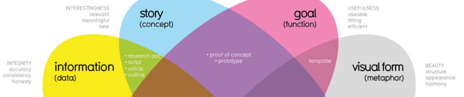
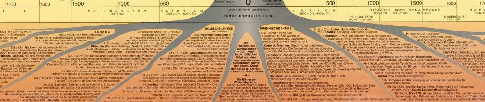
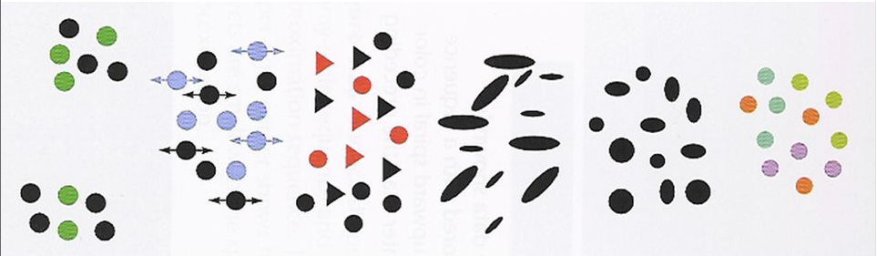
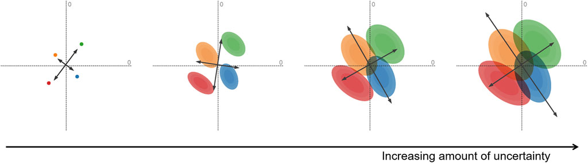
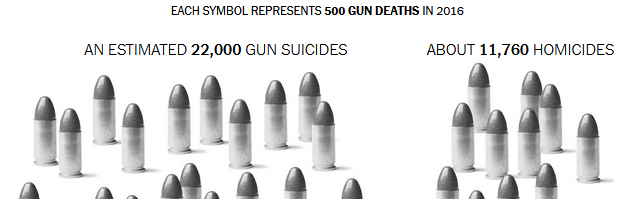

```{r tabfig, echo=FALSE}
knitr::opts_chunk$set(warning = FALSE)
source("R/tabfig.R")
```

This page lists various resources for the course in general, as well as additional links or topics related to individual lectures beyond what
is listed on the [main course page](./). If you find a link that doesn't
work, or could be replaced by something better or more recent, 
[please let me know by filing an issue](https://github.com/friendly/6135/issues).


## General, tutorials {#tutorials}


- Royal Statistical Society [Best Practices for Data Visualisation](https://royal-statistical-society.github.io/datavisguide/): Insights, advice, and examples (with code) to make data outputs more readable, accessible, and impactful.
- [Financial Times Visual Vocabulary](papers/Visual-vocabulary.pdf). A large cheatsheet poster for fining types of graphs to use for different purposes.  
- [Checklist For Good Graphical Practice](GraphicsChecklist.html). From From: Gordon & Finch (2015), a useful set of questions and suggestions to apply to graphs designed for presentation purposes.
- [Twenty rules for good graphics](https://robjhyndman.com/hyndsight/graphics/). This post by Rob Hyndman, describes some _best practices_ for producing
graphs for _journal publication_.

- [British Ecological Society's Guide to Reproducible Science](https://www.britishecologicalsociety.org/wp-content/uploads/2017/12/guide-to-reproducible-code.pdf). The guide proposes a simple reproducible project workflow, and a guide to organizing projects for reproducibility. The Programming section provides concrete tips and traps to avoid (example: use relative, not absolute pathnames), and the Reproducible Reports section provides a step-by-step guide for generating reports with R Markdown.

<!-- - [Amazon Mechanical Turk Guide for Social Scientists](https://michaelbuhrmester.wordpress.com/mechanical-turk-guide/) A guide for setting up online data collection tasks on [Amazon Mechanical Turk](http://www.mturk.com/) -->

## Books {#books}

### Main texts {#texts}

```{r do-books, echo=FALSE}
width <- "160px"
tab(class="cellpadding", width="800px",
  tr(
  	tabfig("Ware", "images/books/ware.jpg", 
  	       "https://www.elsevier.com/books/information-visualization/ware/978-0-12-381464-7",
  	       width=width),
  	tabtxt("Colin Ware,",  a("Information Visualization, 3rd Ed.",
  	                         href="https://www.elsevier.com/books/information-visualization/ware/978-0-12-381464-7"),
  	       ". What perceptual science has to say about data visualization, from a bottom-up perspective.", br(),
           "Course notes at", aself("http://ccom.unh.edu/vislab/VisCourse/index.html"))
  	),
  tr(
  	tabfig("Cairo", 
  	       "images/books/Cairo-TruthfulArt.png", 
  	       "https://www.amazon.ca/Truthful-Art-Data-Charts-Communication/dp/0321934075",
  	       width=width),
  	tabtxt("Alberto Cairo,",  a("The Truthful Art",
  	                         href="https://www.amazon.ca/Truthful-Art-Data-Charts-Communication/dp/0321934075"),
  	       ". Information graphics from a communication perspective.", br(),
           "Blog:", aself("http://www.thefunctionalart.com/"))
  	),
  tr(
  	tabfig("Wilke", "images/books/Wilke-FundamentalsOfDataVis.png", 
  	       "https://clauswilke.com/dataviz/", width=width),
  	tabtxt("Claus Wilke,",  a("Fundamentals of Data Visualization",
  	                         href="https://clauswilke.com/dataviz/"),
  	       ". Well thought out, a wide range of topics, good practical advice, lots of examples.
  	        It was written entirely using R Studio and the `bookdown` package, and now online.")
  	)

)
```

  <!-- tr( -->
  <!-- 	tabfig("Kosslyn", "images/books/kosslyn-MindEye.png",  -->
  <!-- 	       "https://global.oup.com/academic/product/graph-design-for-the-eye-and-mind-9780195311846", width=width), -->
  <!-- 	tabtxt("Steven Kosslyn,",  a("Graph Design for the Eye and Mind", -->
  <!-- 	       href="https://global.oup.com/academic/product/graph-design-for-the-eye-and-mind-9780195311846"), -->
  <!-- 	       ". A cognitive psychologist looks at graphs and presents some do's and don'ts." -->
  <!--          ) -->
  <!-- 	) -->


### More books I recommend {#other-texts}

```{r do-books2, echo=FALSE}
width <- "160px"
tab(class="cellpadding", width="800px",
  tr(
  	tabfig("FriendlyWainer", "images/books/FriendlyWainer2021.png", 
  	       "https://www.hup.harvard.edu/catalog.php?isbn=9780674975231", width=width),
  	tabtxt("Michael Friendly & Howard Wainer,",  
  	       a("A History of Data Visualization and Graphic Communicantion",
  	       href="https://www.hup.harvard.edu/catalog.php?isbn=9780674975231"),
  	       ". Everything you've ever wanted to know about the history of data visualization: Who did what, when and why.."
           )
  	),
  tr(
  	tabfig("Christiansen", "images/books/Building-Science-Graphics.png",
  	       "https://www.buildingsciencegraphics.com/", width=width),
  	tabtxt("Jen Christiansen,",  
  	       a("Building Science Graphics",
  	         href="https://www.buildingsciencegraphics.com/"),
  	       ". An illustrated guide to communicating science through diagrams
           and visualizations. Beautifully illustrated itself, it outlines a process
           for creating graphics using evidence-based design strategies.")
  	),
  tr(
  	tabfig("Munzner", 
  	       "images/books/munzner.png", 
  	       "https://www.crcpress.com/Visualization-Analysis-and-Design/Munzner/p/book/9781466508910", 
  	       width=width),
  	tabtxt("Tamara Munzner,",  
  	       a("Visualization Analysis & Design",
  	         href="https://www.crcpress.com/Visualization-Analysis-and-Design/Munzner/p/book/9781466508910"),
  	       ". An attractive recent book combining computer science and design perspectives.",
  	       br(),
           "Web page at", aself("http://www.cs.ubc.ca/~tmm/vadbook/"), "with lots of illustrations and lectures")
  	),
  tr(
  	tabfig("Wainer", 
  	       "images/books/Wainer-graphic-discovery.png", 
  	       "https://press.princeton.edu/titles/7820.html", 
  	       width=width),
  	tabtxt("Howard Wainer,",  
  	       a("Graphic discovery: a trout in the milk and other visual adventures",
  	         href="https://press.princeton.edu/titles/7820.html"),
  	       ". A collection of essays on the history of graphics and other topics.")
  	),

  tr(
    tabfig(
      name = "Koponen",
      img = "images/books/Koponen-DataVisHandbook.jpg",
      href = "https://www.datavizhandbook.info/",
      width = width
    ),
    tabtxt(
      "Koponen & Hilden",
      a("Handbook of Data Visualization", href="https://www.datavizhandbook.info/"),
      ". A practical guide for creating compelling graphics to explain and explore data, primarily aimed at designers, journalists, researchers, analysts, and other professionals who want to learn the basics of visualization. Lovely illustrations!",
      br(),
      "Some content on", a("Google books", href = "https://www.google.ca/books/edition/Data_Visualization_Handbook/PbybDwAAQBAJ?hl=en&gbpv=1&printsec=frontcover")
    )
  )

)
```

### Tufte Stufte {#tufte}

Four books by Edward Tufte largely defined the landscape for data visualization and
information design.

```{r do-tufte, echo=FALSE}
height <- "160px"
tab(class="cellpadding", height="160px", width="800px",
  tr(
  	tabfig("Tufte-VisualDisplay", "images/books/Tufte-VisualDisplayQuantInfo.png", 
  	       "https://www.edwardtufte.com/tufte/books_vdqi", height=height),
  	tabfig("Tufte-VisualExplanation", "images/books/Tufte-VisualExplanation.png", 
  	       "https://www.edwardtufte.com/tufte/books_visex", height=height),
  	tabfig("Tufte-Envisioning", "images/books/Tufte-EnvisioningInfo.png", 
  	       "https://www.edwardtufte.com/tufte/books_visex", height=height),
  	tabfig("Tufte-Beautiful", "images/books/Tufte-BeautifulEvidence.png", 
  	       "https://www.edwardtufte.com/tufte/books_be", height=height)
  	)
)
```


## Blogs & Web Resources {#blogs}

The following blogs are a rich source of information on visual design, data graphics and the history of data visualization.

```{r do-blogs, echo=FALSE}
width <- "320px"
tab(class="cellpadding", width="800px",
  tr(
  	tabfig("datavis.ca", 
  	       "images/blogs/datavis.ca.png", 
  	       "http://datavis.ca", width=width),
  	tabtxt("My web site,", aself("http://datavis.ca"),
  	       ". Contains the ", a("Milestone Project", href="http://datavis.ca/milestones"), "on the history of data vis, the ",
           a("Data Visualization gallery", href="http://datavis.ca/milestones"), "links to books, papers, courses, and software.")
  	),
  tr(
  	tabfig("FlowingData", 
  	       "images/blogs/flowingdata.png", 
  	       "http://flowingdata.com/", width=width),
  	tabtxt("Nathan Yau,", aself("http://flowingdata.com/"),
  	       "A large number of blog posts illustrating data visualization methods with tutorials on how do do these with R and other software.")
  	),

  tr(
  	tabfig("Junk Charts", 
  	       "images/blogs/junkcharts.png", 
  	       "http://junkcharts.typepad.com/", width=width),
  	tabtxt("Kaiser Fung,", aself("http://junkcharts.typepad.com/"),
  	       "Fung discusses a variety of data displays and how they can be improved.")
  	),
  
  tr(
  	tabfig("Data Stories", 
  	       "images/blogs/datastories.png", 
  	       "http://datastori.es/", width=width),
  	tabtxt("A podcast on data visualization with Enrico Bertini and Moritz Stefaner,",
  	       aself("http://datastori.es/"), 
  	       ". Interviews with over 100 graphic designers & developers.")
  	),
	tr(
		tabfig("Kantar", 
		       "images/blogs/kantar.png", 
		       "https://www.informationisbeautifulawards.com", width=width),
		tabtxt("Kantar Information is Beautiful Awards ",
		       aself("https://www.informationisbeautifulawards.com"), 
		       "Celebrates excellence and beauty in data visualizations,infographics, interactives & information art. ")
		),
	tr(
		tabfig("Info We Trust", 
		       "images/blogs/infowetrust.png", 
		       "http://infowetrust.com/", width=width),
		tabtxt("Raymond Andrews, ",
		       aself("http://infowetrust.com/"), 
		       "A visual storyteller delights with graphic stories from the history of data visualization. ")
		),
	tr(
		tabfig("Visualizing Data", 
		       "images/blogs/VD_Logo.png", 
		       "https://www.visualisingdata.com/blog/", width=width),
		tabtxt("Andy Kirk, ",
		       aself("https://www.visualisingdata.com/blog/"), 
		       "Among other things, Kirk provides a monthly digest of his picks for the Best in Data Visualization.")
		),
  
)
```

## Additional session resources {#weekly}

These are additional resources related to weekly topics, many of which were originally suggested by Borzu Talaie (Thx!). Feel free to suggest other topics that can be added to these lists.

### Session 1: Overview {#week1}



- Data Visualization Society [Information is Beautiful Awards, 2023](https://www.informationisbeautifulawards.com/showcase?action=index&award=2023&controller=showcase&page=1&pcategory=winner&type=awards). A showcase of winners from the annual competitions.

- [Foundations of Data Visualization](https://posit-conf-2023.github.io/dataviz-storytelling/materials/01-foundations.html)
Cédric Scherer, Session 1 of a workshop, [Designing Data Visualizations to Successfully Tell a Story](https://posit-conf-2023.github.io/dataviz-storytelling/)

- [Graphical Gaffes by Ben Jones](https://docs.google.com/presentation/d/14zGLucWYnU6qQXzEfmpCuDi3YJ-fKqO3wZ7F1WX5iXk/edit#slide=id.gd38455501d_0_9). A collection of _What Not to Do_ in Graphics.

- Scientific Amercan's [Best Science Graphics of 2023](https://www.scientificamerican.com/article/see-the-best-science-graphics-of-2023/)

- Take a look at some of the visualizations selected by Andy Kirk as his picks for the [Best visualizations in August 2021](https://www.visualisingdata.com/2021/12/best-of-the-visualisation-web-august-2021/)

- [How People Actually Lie With Charts](https://vdl.sci.utah.edu/blog/2023/04/17/misleading/). What makes a visualization misleading? Some _awfully_ nice examples dealing with COVID-19 data.

- [Friends Don't Let Friends](https://github.com/cxli233/FriendsDontLetFriends). Friends don't let friends make certain types of data visualization - What are they and why are they bad.

- [You can’t unsee it – the impact of a good visual for scientific data](https://blogs.egu.eu/divisions/cr/2024/01/22/you-cant-unsee-it-the-impact-of-a-good-visual-for-scientific-data/). A collection of high-impact infographics dealing with climate change.

### Session 2: Varieties Data Visualization {#week2}


* Financial Times [Visual Vocabulary](images/varieties/C:\Dropbox\Documents\6135\images\varieties\VisualVocabulary-poster.pdf) poster, showing examples of different chart types depending on what
you want to show.

* [30 Day Chart Challenge](https://github.com/Z3tt/30DayChartChallenge_Collection2021)
This collection, currated by Cédric Scherer, contains examples of graphs and charts
designed to show visualizations classified by type and topic.  But, more generally,
follow [#30DayChartChallenge](https://twitter.com/30DayChartChall) on Twitter.

* [Out of Sight, Out of Mind](http://drones.pitchinteractive.com)
A great example in storytelling with data: history of drone strikes in Pakistan


### Session 3: History of Data Visualization {#week3}




* [Album de Statistique Graphique](https://richardbrath.wordpress.com/2018/12/31/album-de-statistique-graphique/)
A blog post by Richard Brath picks out some features in this remarkable series of statistical albums

* Salomé Esteves [The people DataViz’s history ignores: a step forward to an intersectional history of Data Visualization](papers/Esteves-People_DataViz_history_ignores.pdf). An attempt to broaden the history of dataviz, recognizing women and people of color.


<!-- * Douglas Engelbert -->
<!-- [Inventor of the computer mouse as a pointing system](https://www.youtube.com/watch?v=AN0bP8764do). -->
<!-- Also check out his 1968 demo nicknamed: [The Mother of All Demos](https://www.youtube.com/watch?v=yJDv-zdhzMY). -->

* Katharine Harmon [The Map as Art](https://www.amazon.ca/Map-Art-Contemporary-Artists-Cartography/dp/1568989725/ref=sr_1_1?ie=UTF8&qid=1548080669&sr=8-1&keywords=map+as+art). She also has another good book on maps called: [You Are Here](https://www.amazon.ca/You-Are-Here-Geographies-Imagination/dp/1568984308/ref=sr_1_2?s=books&ie=UTF8&qid=1548080732&sr=1-2)

### Session 4: Graphical perception {#week4}



* [The Illusions Index](https://www.illusionsindex.org/) is a fully searchable, curated collection of illusions.
**Warning**: Some may blow your mind!

* Captain Disillusion video [CD Color](https://www.youtube.com/watch?v=FTKP0Y9MVus). 
"The most important thing to know about color is that it doesn't exist."

* Emil Hvitfeldt has compiled a [Comprehensive list of color palettes available in R](https://github.com/EmilHvitfeldt/r-color-palettes) with examples of each.

### Session 5: Human Factors {#week5}


* Ben Schneiderman's [The Eight Golden Rules of Interface Design](http://www.cs.umd.edu/~ben/goldenrules.html) distills the vast corpus of user interface design into a few key principles.

* How do we read pie charts? You might think you read pie charts by angle, but you don't. Robert Kosera
lays out some evidence in this Youtube video [The Science of Pie Charts](https://youtu.be/NxmHDNNTFyk).

* The New York Times [You Draw It: How Family Income Predicts Children’s College Chances](https://www.nytimes.com/interactive/2015/05/28/upshot/you-draw-it-how-family-income-affects-childrens-college-chances.html) is an interactive app that asks you to draw what you think is the relationship between family income and percent of children who go to college. Robinson et al. [Eye Fitting Straight Lines in the Modern Era](https://www.tandfonline.com/doi/full/10.1080/10618600.2022.2140668) use this to study how people fit lines to data points by eye.

* Alan Lundgard & Arvind Satyanarayan [Accessible Visualization via Natural Language Descriptions: A Four-Level Model of Semantic Content](http://vis.csail.mit.edu/pubs/vis-text-model).
Considers how to write figure captions or alt-text to better communicate and contextualize graph insights, and to improve their accessibility for readers with disabilities.

* Nancy Organ [An Incomplete Guide to Accessible Data Visualization](https://towardsdatascience.com/an-incomplete-guide-to-accessible-data-visualization-33f15bfcc400)

* [Dataviz Accessibility Resources](https://github.com/dataviza11y/resources) lists a wealth of papers, blogs, software tools, etc. on data visualization accessibility

* [Accessible Visualization: Design Space, Opportunities, and Challenges](https://onlinelibrary.wiley.com/doi/10.1111/cgf.14298). This paper gives a comprehensive survey of papers published for the last 20 years on visualization accessibility.

### Session 6: The Language of Graphs {#week6}


* [Claus Wilke, SDS 375/395 Data Visualization in R](https://wilkelab.org/SDS375/)
This is a comprehensive course in R graphics (mainly ggplot2 & friends), 
based on Wilke's [_Fundamentals of Data Visualization_](https://clauswilke.com/dataviz/).

* [Jer Thorp](https://www.jerthorp.com). National Geographic video: [Numbers that paint the picture](https://www.youtube.com/watch?v=dmzdqRIS7SI).
Look for his OOH/AAH metaphors at the 8:20 marker.

* Cole Nussbaumer: [Storytelling with Data](https://www.amazon.ca/Storytelling-Data-Visualization-Business-Professionals/dp/1119002257/ref=sr_1_1?keywords=storytelling+with+data&qid=1549739814&s=gateway&sr=8-1). For those interested in the narrative side of Dataviz

* [Raw graphics](https://rawgraphs.io).
A very good online resource to easily poke at your datasets.

* [The Johnny Cash Project](http://www.thejohnnycashproject.com).
A very interesting project that used crowdsourcing like Amazon Mechanical Turk for its creative content.

* [Visualization of geographical data.](https://volaya.github.io/gis-book/en/Visualization.html).
Chapter 1 has an overview of visual variables, as applied to mapping.


### Session 7: ggplot2 basics {#week7}


* Deepali Kank's [Tidy Tuesday 2023](https://github.com/deepdk/TidyTuesday_2023) collection of
R scripts using `ggplot2` and `tidyverse` principles to produce some lovely graphics. See the
[Tidy Tuesday Github site](https://github.com/rfordatascience/tidytuesday) for details of the
topics.


* [Data Visualization and D3](https://www.superhi.com/courses/data-visualization-with-d3)
A very good online resource (although a bit pricy) if you are interested in learning D3. Here is the 
[course syllabus](papers/superhi-data-visualization-syllabus.pdf).

### Session 8: Going further in the tidyverse {#week8}


* Cédric Scherer [Engaging and Beautiful Data Visualizations with ggplot2](https://posit-conf-2023.github.io/dataviz-ggplot2/). A one-day workshop for those who already know a bit of ggplot2, but want to take their graphs to the next level.

* Frank Harrell's [R Workflow](https://hbiostat.org/rflow/), intended to foster best practices in reproducible data documentation and manipulation, statistical analysis, graphics, and reporting. Very complete, but relies heavily on Harrell's [Hmisc](https://cran.r-project.org/package=Hmisc) package.

### Session 9: Visualizing Uncertainty {#week9}




* David Weiskopf [Uncertainty Visualization: Concepts, Methods, and Applications in Biological Data Visualization](https://www.frontiersin.org/articles/10.3389/fbinf.2022.793819/full)

* [Cartography and Visualization: The Visualization of Uncertainty](https://www.e-education.psu.edu/geog486/node/693)

### Session 10: Data Journalism {#week10}



* [Data Journalism Toolkit](https://ksj.mit.edu/resource/data-journalism-tools/toolkits-and-programs/).
A collection of tools to help journalists acquire, analyze, visualize, map, and otherwise make use of
data in reporting.

* [Journalism in the Age of Data](http://datajournalism.stanford.edu/index.html)
A very interesting video report on data as a storytelling medium – a bit outdated, but still holds some interesting content.
(There is an annotated version, which requires Flashplayer)


* Nate Silver is the guy behind the [FiveThirtyEight](http://fivethirtyeight.com) website. 
Trained as a statistician, he predicted Obama’s win in 2008!
See his book: [The Signal and the Noise: Why So Many Predictions Fail – but Some Don't](https://www.amazon.ca/Signal-Noise-Many-Predictions-Fail-but/dp/159420411X/ref=sr_1_1?keywords=nate+silver&qid=1552770263&s=gateway&sr=8-1)

* Swing-O-Matic: [How Demographics Will Shape The 2016 Election](https://fivethirtyeight.com/features/how-demographics-will-shape-the-2016-election/)

* [Krisztina Szucs](http://krisztinaszucs.com/vizmarathon/) – a quick analysis on two of her projects by [Angela Nobel](papers/Krisztina Szucs–ANobel.pdf) Borzu: I really like her work on the frequency of the spread of diseases

* [How Music Taste Evolved](https://pudding.cool/2017/03/music-history/) (by the Pudding).
Borzu: In my opinion, this project is one of the most engaging dataviz projects in terms of storytelling. Enjoy!


* Hans Rosling: [200 years in 4 minutes](https://www.youtube.com/watch?v=Z8t4k0Q8e8Y) – another example/approach in storytelling with data


## Software for graphics in [R](https://r-project.org) {#Rblogs}

```{r do-blogs2, echo=FALSE}
width <- "320px"
tab(class="cellpadding", width="800px",
	tr(
		tabfig("Visiphilia", "images/blogs/visiphilia.png", "http://visiphilia.org/", width=width),
		tabtxt("At ",
		       aself("http://visiphilia.org/"), 
		       "statisticians Di Cook and Heike Hofmann from Iowa State University blog about data visualization topics, using R ")
		),
	tr(
		tabfig("R-bloggers", "images/blogs/Rbloggers.png", "https://www.r-bloggers.com/", width=width),
		tabtxt(
		       aself("https://www.r-bloggers.com/"), 
		       "A large collection of posts on R news and tutorials by over 750 R bloggers.")
		),
	tr(
		tabfig("socviz-co", "images/blogs/socviz-co.png", "http://socviz.co/", width=width),
		tabtxt("Kieran Healy,",
		       aself("http://socviz.co/"), 
		       "Data Visualization for Social Science: A practical introduction with R and ggplot2.")
		),
	tr(
		tabfig("DataVis Catalog", "images/blogs/datavis-catalog.png", "https://datavizcatalogue.com/blog/", width=width),
		tabtxt("DataVis Catalog,",
		       aself("https://datavizcatalogue.com/blog/"), 
		       "Extended discussions of variations of a given chart type.")
		)
)
```

## R {#R}

* Instructions to install R and R Studio for [Windows](R/installing-r-rstudio-windows.pdf) and [Mac](R/installing-r-rstudio-mac.pdf). 

* My [install-packages.R](R/install-pkgs.R) R script, to install the most useful packages for this course.

* [R Studio cheatsheets](R/rstudio-cheat-sheets.pdf). A handy collection of cheat sheets for R, R Studio and a number of the most useful R packages.

* [R for Social Scientists](https://datacarpentry.org/r-socialsci/). A short course introduction to R, covering also data wrangling with `dplyr` and `tidyr`, graphics with `ggplot2`, using Rmarkdown for documents, ...

* [Happy git and github for the useR](http://happygitwithr.com/) provides a good overview of how to use Git and GitHub in conjunction with an R-based workflow.

- [A primer on web scraping with R](https://github.com/simonmunzert/rscraping-aapor-2017) by Simon Munzert. Includes slides from a workshop and lots of links to resources.

- [Flipbook introduction to ggplot2](https://evamaerey.github.io/ggplot_flipbook/ggplot_flipbook_xaringan.html) by Gina Reynolds. An introduction to `ggplot2` showing the effect of each bit of code for a plot.  

## Presentation/project ideas   {#project-ideas}

Here are a few ideas (in no particular order) for the course presentation or project:

* [Winners of the ASA Police Data Challenge student visualization contest](http://blog.revolutionanalytics.com/2017/12/police-data-challenge.html). The American Statistical Association teamed up with the [Police Data Initiative](https://www.policedatainitiative.org/), which provides open data from local law enforcement agencies in the US, to create a competition for high school and college students to analyze crime data from Baltimore, Seattle and Cincinnati.  Explore some data and create your own visualization.

* Somewhat related, [OpenIntro](https://www.openintro.org/data/index.php) maintains a large set of datasets, one of which details [Fatal police shootings](https://www.openintro.org/data/index.php?data=fatal_police_shootings) by on-duty officers since Jan. 2015.
Collected by the Washington Post. This includes 6400 incidents, with many variables on the nature of the incident and the age, race, sex of the victim.

* [The 50 Most Influential Living Psychologists](https://thebestschools.org/features/most-influential-psychologists-world/). This page gives brief biographies of a collection of 50 living psychologists called the most influential in the world. How can this collection be visualized in terms of their attributes (area of psychology, age, gender, ...)?  You'll need to scrape the data from the web page.  Here is a start on that:

```{r influential, eval=FALSE}
library(rvest)
library(stringr)
url <- "https://thebestschools.org/features/most-influential-psychologists-world/"
page <- read_html(url)
items <- page %>% html_nodes("h3") %>% html_text() 
items <- items[grep("More", items, invert=TRUE)]
items <- sub("^\\d+\\. ", "", items, perl=TRUE)
```


* [Graphical inference for Info Vis](http://ieeexplore.ieee.org/abstract/document/5613434/). Wickham et al. (2010) describe a graphical "lineup" technique for doing statistical inference with graphs and human judges.  Do a literature review of this topic and design a possible experimental use of this technique. There is an R package, [nullabor](https://cran.r-project.org/package=nullabor) with this
[vignette](https://cran.r-project.org/web/packages/nullabor/vignettes/nullabor.html) for contstructing such graphical displays.

* **Best practices** for research presentations using data graphics: How to best communicate your results in a conference presentation or in a poster?

* **Redesigning maps** for usability: One of the best early examples is [Harry Beck's London Tube Map](https://tfl.gov.uk/corporate/about-tfl/culture-and-heritage/art-and-design/harry-becks-tube-map), which has become iconic. But there have been many other additions to the literature on this topic.  Some local examples of maps that could use a design-overhaul are:
    * The [Toronto PATH map](http://torontopath.com/path-map/), showing the 30 km of walkways underneath a large part of the dpowntown core.
    * The [York Campus Map](http://maps.info.yorku.ca/files/2013/02/KEELE_Map_Colour.pdf), showing all buildings on the Keele Campus.  

* **Language of Graphs**: Characteristics of different computer languages for graphics, including aspects of syntax, semantics and expressive power. See me for some pointers and references.
  * Nicolas Kruchten [Metrics for Reasoning About the Usability of Visualization Notations](https://medium.com/multiple-views-visualization-research-explained/metrics-for-reasoning-about-the-usability-of-visualization-notations-6c03b9292780)

* **Online experiments**: More and more psychologists are using computer-controlled methods of data collection, either with specific software for personal computers or with web-based or cloud-based application.  Some of these use graphics, either for stimulus presentation or for displaying results.

* **Measures of graph literacy**: In many studies of graph perception, it is useful to measure a construct of ability to understand graphic information ("graph literacy"). What is the state of the art on this topic?
  * Michael Correll [The Mythos of Visualization Literacy](https://mcorrell.medium.com/the-mythos-of-visualization-literacy-5dd02db56254)
  * Lee et al. [VLAT : Development of a Visualization Literacy Assessment Test](https://www.bckwon.com/pdf/vlat.pdf)
  * Mirta Galesic [Graph Literacy: A Cross-Cultural Comparison](https://citeseerx.ist.psu.edu/document?repid=rep1&type=pdf&doi=2c8dbb39ecec6e6ca27aabe1f84a134c4adef60a)
  * Related: [Aphantasia](https://en.wikipedia.org/wiki/Aphantasia) - inability to "see" mental images, and some scales for measuring the same.

* **Accessibility**: Making graphics accessible to the visually impaired. A simple example is **ALT** text, now increasingly used.  Are there standards or tools available? See the links under [Human factors](#week5) above.

  * Somewhat related: Data **sonification & haptics**-- using sound and other modalities, e.g., [Loud Numbers](https://www.loudnumbers.net/); the [Data Sonification Archive](https://sonification.design/); Google's [TwoTone](https://twotone.io/), a free open-source web app to turn data into music
  * [Erie: A Declarative Grammar for Data Sonification](https://arxiv.org/abs/2402.00156). Describes how a sonification maps data variables to sound variables like time, pitch, and volume. E.g., an auditory histogram can map bins to time and the count to pitch.

* **Other dataviz & graphic software**: 
  + [Observable](https://observablehq.com/), a dynamic, extensible graphics system built on [D3](https://d3js.org/), a free, open-source JavaScript library for visualizing data
  + [Figma](https://www.figma.com/), a graphic design system, often used to "gussy-up" plots done with R.
  + Python graphics libraries: [plotnine](https://plotnine.readthedocs.io/en/v0.12.4/), an implementation of a grammar of graphics in Python based on `ggplot2`.  There are many other [Python libraries for data visualization](https://www.knowledgehut.com/blog/business-intelligence-and-visualization/python-data-visualization-libraries): [matplotlib](https://matplotlib.org/), [plotly](https://plotly.com/), ...

* **Data physicalization**: representation of data by physical objects
  + [Opportunities and Challenges for Data Physicalization](http://yvonnejansen.me/dataphys)
  + [Data physicalization wiki](http://dataphys.org/). A collection of links and resources on the topic.
  + [Making with Data: Physical Design and Craft in a Data-Driven World](https://makingwithdata.org/). an edited book on the topic.

