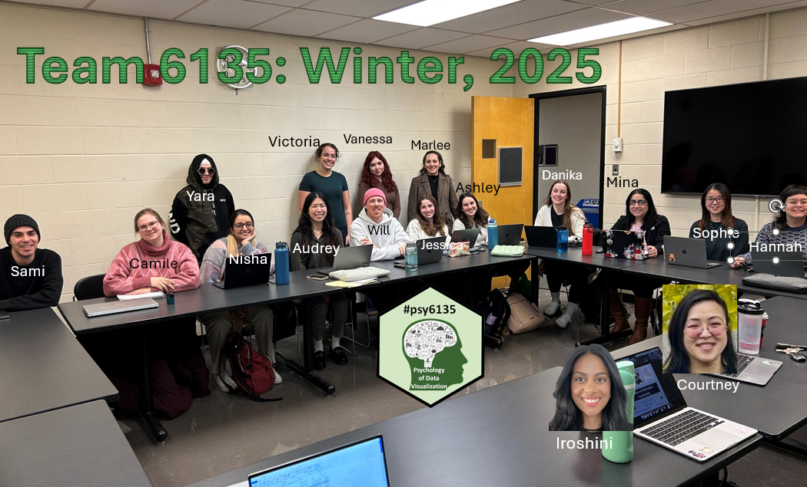
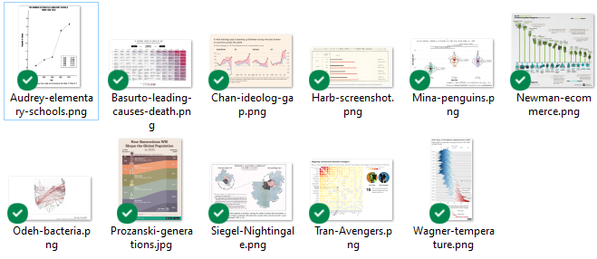
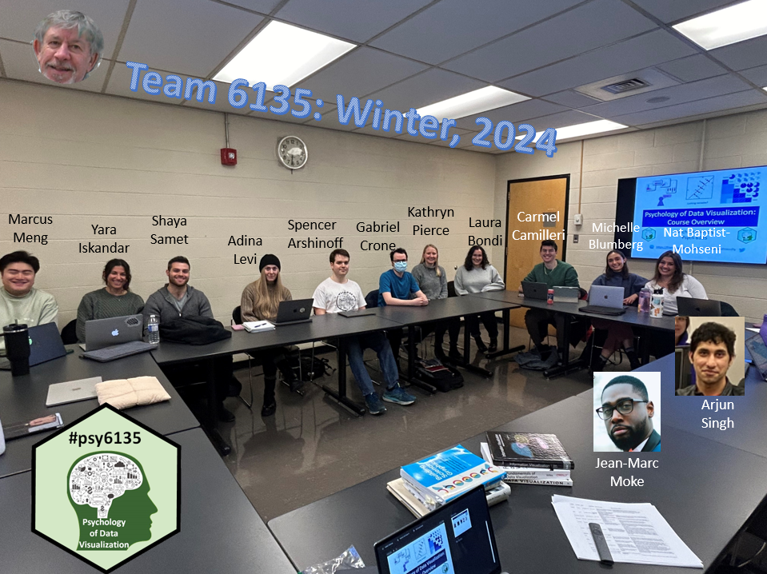

This page exists only to recognize the contributions of past students in this course and to serve as examples and guidance for current students. It is also a tribute to their work and enthusiasm!

All materials linked on this page are the intellectual property of the students in this course.  They may not be
reproduced or used in any other manner without express permission of the student involved.
Don't even think about it.

Jump to: [2025](#2025) <||> [2024](#2024) <||> [2022](#2022) <||> [2021](#2021) <||> [2019](#2019) <||> [2018](#2018) 

## 2025 {#2025}

 

### Assignment: Graphs that tell an interesting story

Find one example of a data graph that attempts to tell an interesting story of a useful topic. How well does it succeed? How could it be improved?

 

### Discussion leader mini presentations  

- Camille Proszanski: [From Thematic Maps to Brain Maps](students/2025/MiniPres/Prozanski-Thematic maps to Brain Maps.pptx)
- Iroshini Gunasekera: [Visualizing weather through history](students/2025/MiniPres/Iroshini_Visualizing_weather.pptx)
- Hannah Tran and Courtney Chan: [Biases in Data Visualization](students/2025/MiniPres/Tran_Chan-Biases-in-Graph-Making.pptx)
- Nisha Vashi: [Human Factors: Eliciting emotional reactions within data visualizations](students/2025/MiniPres/NishaVashi-Mini-Presentation.pptx)
- Marlee Salisbury: [The Risk of Visualizing Risk](students/2025/MiniPres/Marlee_TheRiskofVisualizingRisk.pptx)
- Ashley Siegel & Sami Harb: [Graph design and interpretation: Cultural considerations & Health Risk Communication](students/2025/MiniPres/Siegel_Harb_Presentation_6135.pptx)
- William Fisher: [ggplot2 and efficiently generating several plots 
](students/2025/MiniPres/WillFisher-MiniPresentation.pptx)
- Jessica Newman and Danika Wagner [ggplot2: the untold story](students/2025/MiniPres/Wagner-Jessica Newman-ggplot.pptx)
- Victoria Celio & Vanessa Basurto [Interactive Visualizations](https://www.canva.com/design/DAGfBujntkA/fuqCfF6TiF8jt6p9--EUJg). Also: [A Shiny Example](https://fohpsyc.shinyapps.io/InteractiveVizDemo/).

## 2024 {#2024}

 

### Discussion leader mini presentations  

- Kathryn Pierce [Hans Rosling: Revolutionizing Global Understanding](students/2024/mini-pres/Katheryn-presentation.pptx)
- Carmel Camilieri [How Visualizations Gave Birth to Modern Day Epidemiology](students/2024/mini-pres/Carmel-data_viz_presentation.pdf)
- Marcus Meng [Chart junk: Trash and Treasure](students/2024/mini-pres/Marcus-Presentation-Feb1.pptx)
- Spencer Arshinoff [Individual Differences in Graphical Perception](students/2024/mini-pres/Arshinoff-2024-Feb8.pptx)
- Laura Bondi [Data Storytelling](students/2024/mini-pres/Bondi-Language_of_Graphs-MiniPresentation.pptx)
- Gabriel Crone & Jean-Marc Moke [Duel of the Defaults: Graphical Defaults in point-and-click vs. code-based software](students/2024/mini-pres/Moke-Crone-Duel of the Defaults.pptx)
- Arjun Singh [Visualizing Longitudinal Data](https://arjun10g.github.io/Vizualizing-Longitudinal-Data/)
- Adina Levi & Shaya Samet [Visualizing Uncertainty](students/2024/mini-pres/Adina-Shaya-Uncertainty.pdf)
- Michelle Blumberg & Natasha Baptist-Mohseni [Data Journalism in the Digital Era](students/2024/mini-pres/Nat-Michelle-DataJournalism-Discussion.pptx)

### Class presentations   {#2024-presentations}

- Natasha Baptist-Mohseni & Michelle Blumberg [Using Data Visualization to Improve Neuropsychological Feedback](students/2024/presentations/PSYC6135-Presentation_Nat-Michelle.pdf)
- Carmel Camilleri [The use of visualizations and data in modern day European soccer](students/2024/presentations/Camillier-DataViz-soccer.pdf)
- Adina Levi & Shaya Samet [Data Visualization in Healthcare](students/2024/presentations/Adina-Shaya-PSYC6135_Healthcare.pdf)
- Arjun Singh [Gohan The Husky! A Journey Through Time and Space](https://arjun10g.github.io/Puppy-Pres-2/)
- Laura Bandi [Aesthetics and Colour Use in Data Visualizations](students/2024/presentations/Bandi-Color.pdf)
- Spencer Arshinoff [Data Physicalization](students/2024/presentations/Arshinoff-Data_Physicalization_Presentation.pptx)
- Gabriel Crone [Making the invisible visible: Visualizing latent variables in Structural Equation Modeling](students/2024/presentations/Crone-Visualizing-SEM.pdf)
- Xianze Meng [Approaches to Visualizing Neuroscience Data](students/2024/presentations/Meng-DataVisualizationNeuroscience.pptx)
- Jean-Marc Moke [Strategic Business Decisions Vizualised](students/2024/presentations/VisualizingBusinessStories_Moke_PSYC6135.pptx)
- Kathryn Pierce [Satellite Journalism](students/2024/presentations/Pierce-Satellite_Journalism.pdf)

Winners of the 2024  **Jim Rankin Award**: {#2024-rankin}

- 🥇 Spencer Arshinoff - [Data Physicalization](students/2024/presentations/Arshinoff-Data_Physicalization_Presentation.pptx)
- 🥈 Gabriel Crone - [Visualizing latent variables in SEM](students/2024/presentations/Crone-Visualizing-SEM.pdf)
- Honorable mention: Laura Bandi - [Aesthetics and Colour Use in Data Visualizations](students/2024/presentations/Bandi-Color.pdf)

### Research projects   {#2024-projects}

- Spencer Arshinoff [The Role of Spoken Language in Graphical Perception](students/2024/final-paper/Arshinoff-6135 Final Paper.docx)
- Natasha Baptist-Mohseni [To Bleed or Not to Bleed: Period Poverty in an Age of Data Journalism](students/2024/final-paper/Babtist-Mosheni-6135 Final Project.docx)
- Michelle Blumberg [Using Knowledge Visualization to Improve Health Knowledge Translation](students/2024/final-paper/Blumberg-Final Paper.docx)
- Carmel Camilleri [TidyVerse Trek: Embark on Your Data Odyssey](students/2024/final-paper/CarmelCamilleri-Research Proposal.pdf)
- Gabriel Crone [Have Psychologists Lost The Plot? Analyzing the Quantity and Quality of Data Graphics in Psychology Papers](students/2024/final-paper/GabrielCrone_Final Data Viz Paper.pdf)
- Adina Levi [The Effectiveness of Data Visualizations in Facilitating Informed Decision-Making Processes During Pregnancy](students/2024/final-paper/Levi_FinalPaper2024.docx)
- Xianze Meng [Figures and captions – The Scroll-maggedon in Modern Publications](students/2024/final-paper/XianzeMeng-Research Proposal.pdf)
- Shaya Samet [Exploring the Influence of Data Visualization on Trends in the National Hockey League](students/2024/final-paper/Samet_Psyc6135_Paper.docx)
- Arjunvir Singh [Interactive Data Visualization](https://arjun10g.github.io/Interactive-Viz/)
- Jean-Marc Moke [X's and Toes: The representation of three-way interactions on linear versus bar graphs](students/2024/final-paper/Moke-6135_FinalPaper.docx)
- Lara Bandi

## 2022 {#2022}

### Discussion leader mini presentations  

- Emma Ritchie [Florence Nightingale & Women in the History of Data Visualization](students/2022/mini-pres/Ritchie-Nightingale_Jan25.pptx)
- Tasfia Ahsan [Grammar of Graphics -> Sentences](students/2022/mini-pres/Ahsan-grammar_of_graphics_Mar1.pdf)
- Naomi Martinez Gomez [Discecting a ggplot2-based function](students/2022/mini-pres/Naomi-mini_discussion.pptx)
- Udi Alter [plotly & ggplotly: Going slightly beyond the tidyverse](students/2022/mini-pres/Alter-mini-presentation.pdf)
- Stephanie Bell [Mapping Uncertainty For Climate and Temperature Data](students/2022/mini-pres/Bell-Mapping Uncertainty in Geodata.pptx)

### Class presentations  

- Tasfia Ahsan [That’s fake news! Misconceptions in News Stories](students/2022/presentations/Ahsan_ProjectPresentation.pdf)
- Udi Alter [Flexdashboard](students/2022/presentations/Alter-classpresentation.pdf) || [Flexdashboard example](students/2022/presentations/flexdashboard.zip)
- Stephanie Bell [Graph Literacy](students/2022/presentations/Bell-EvaluatingGraphicalLiteracy.pptx/)
- Naomi Martinez Gomez [Shiny for Data Visualization](students/2022/presentations/Martinez-ShinyDataViz.pdf)
- Emma Ritchie [Visualizing Qualitative Data](students/2022/presentations/Ritchie-6135 Presentation.pptx)

### Research projects  

- Tasfia Ahsan [Using data comics to make data more understandable in the field of medicine](students/2022/proposal/Ahsan_6135_Final_Paper.pdf)
- Udi Alter [Raising the Bar Graph: Upgrading to Interactive Dynamic Data Visualizations in Psychology](students/2022/proposal/Alter-finalproject.html) Winner of the 2002 **Jim Rankin Award**
- Stephanie Bell [Representation Matters: A Proposed Visual Diagnostic of the State of LGBTQ+ Representation in American Television Media](students/2022/proposal/Bell-RepresentationMatters.docx)
- Naomi Martinez Gomez [The Absolute Judgement of Statistical Graphics: A Proposal](students/2022/proposal/Martinez_Proposal_PSYC6135.pdf)
- Emma Ritchie [Visualizing the Relationship Between Simultaneous Alcohol and Marijuana Use](students/2022/proposal/Ritchie-6135FinalPaper.docx)

## 2021 {#2021}

### Discussion leader mini presentations  

- Samantha Chan [Crowdsourcing and Information Visualization Evaluation](students/2021/mini-pres/Chan-Crowdsourcing.pdf)
- Samantha Chan & Traci Fabri [Infographics and Knowledge Translation](students/2021/mini-pres/Chan-Fabri-Data Visualization_Infographics.pdf)
- Chantell Ivanski [Colors in data visualization](students/2021/mini-pres/ChantelleIvanski-Colours in Data Visualization.pdf)
- Holly Echlin [Visual Representations of COVID-19 data](students/2021/mini-pres/Echlin data journalism covid.pdf)
- Traci Fabri [The History and Data Encoding of Pie and Donut Charts](students/2021/mini-pres/Fabri-Pie and Donut Charts.pdf)
- Iris Yusupov [Data Journalism: Anti-Indigenous Racism](students/2021/mini-pres/Iris Yusupov Mini Discussion.pdf)
- Krista Mitchnick [Graphical Abstracts](students/2021/mini-pres/Krista Mitchnick - Graphical Abstracts.pptx)
- Samantha Roberts [Data Transparency Uing Violin Plots](students/2021/mini-pres/Roberts-Violin Plots.pptx)
- Michael Truong [Applying Functions to Lists and Parallelism in R](students/2021/mini-pres/Truong-Purrr_R_Parallelism_MTruong_v2.pptx)
- Ruth Vanstone [Communicating Healthcare Data to Patients](students/2021/mini-pres/Vanstone healthcare data presentation.pdf)
- Alyssia Wilson [Data Visualization During A Pandemic](students/2021/mini-pres/Wilson-Data visualization druing the pandemic.pdf)
- Cassandra Wyers [Nightingale’s impact on social change](students/2021/mini-pres/Wyers-Nightingale impact on social change.pdf)

### Class project presentations  

- Stephanie Raposo & Chantell Ivanski [Did you see that? The role of graphics in media articles](students/2021/presentations/Ivanski_Raposo_Graphs in Media.pdf)
- Ruth Vanstone & Krista Mitchnick [Making data accessible: Tactile and sonified data](students/2021/presentations/Mitchnick_Vanstone_Data accessibility.pdf)
- Holly Echlin & Samantha Roberts [Efficiency of Stream Graphs](students/2021/presentations/StreamGraphs_Echlin Roberts.pdf)
- Michael Truong [Visualizing Brain Activity](student/2021/presentations/TruongV4.pptx)
- Cassy Wyers & Alyssia Wilson [Cassy Wyers & Alyssia Wilson - Physiological Response to Data Visualization](students/2021/presentations/Wilson-Wyers.pdf)
- Andrea Aternali & Amanda Piccirilli [Feminist Data Visualization](students/2021/presentations/Andrea-Amanda-Feminist Data Vis.pdf)
- Anthony Battaglia [NHL Data Analytics and Visualization](students/2021/presentations/Battaglia_NHL_DataViz.pdf)
- Samantha Chan & Tracy Fabri [Infographics And Knowledge Translation](students/2021/presentations/Chan-Fabri-Infographics.pdf)
- Arleen & Iris Yusupov [Data Visualization For Good](students/2021/presentations/Iris-Arleen-Data Visualization for Good.pdf)

## 2019 {#2019}

### Discussion leader mini presentations

- [Vanessa Rowlin - TREES: Data Visualisation in Geneology](students/2019/discussion/VROWLIN_Data Visualization in Genealogy.pdf)
- [KB Zaidi - History of Data Vis](students/2019/discussion/History_of_Data_Vis-KB_Zaidi.pdf)
- [Borzu Talaie](students/2019/discussion/BorzuPresentation2019.pdf)
- [Jala Rizeq - Illusions](students/2019/discussion/RizeqJ_minipres_illusions.pptx)
- [Justine Ledochowski - Overview of Human Factors research](papers/Paneels-Roberts-HapticEncoding.pdf)
- [Mathew Cutone - Multi-modal encoding for information displays](papers/Paneels-Roberts-HapticEncoding.pdf)
- [Natalie Beribisky - How do we (MIS)interpret graphs?](students/2019/discussion/Graphical Interpretation.pptx)
- [Borzu - DYI Bertin Matrix](students/2019/discussion/Borzu-diymatrix.pdf)

### Class presentations

Each student will give a brief presentation on a topic of research, application, or software related to data visualization,
as described on the [About](about.html) page.
The best paper will be given the Jim Rankin Award.

Here is the [6135 Presentations 2019](https://docs.google.com/spreadsheets/d/1grrM9h9pz6PfmpEvSNF4RcUVOsab8QtL7MsvBvogQdA/edit?usp=sharing) signup sheet.

#### March 28

- [Mathew Cutone - Augmented Reality Information Displays](students/2019/presentation/Cutone-datavis_ar.pdf)
- [Justine Ledochowski - Visulization for Social Change](students/2019/presentation/Data Vis_FinalPres_Ledochowski.pdf)
- [Jala Rizeq - Visualizations in the News](students/2019/presentation/Rizeq_ingorgraphics_pres_march27.19.pdf)

#### April 4

- [Natalie Beribisky - Visualizing Climate Change](https://drive.google.com/file/d/1vuETSlElbYsqO3eWC2C8CwSndOk69L8e/view?usp=sharing)
- [Davey Chafe - Data Visualizations in Space](students/2019/presentation/Chafe-DataVisualizationInSpace.pdf)
- [Vanessa Rowlin - Visualization of Baseball Pitcher Data](students/2019/presentation/PSYC6135_VRowlin_BaseballPitchFX.pdf)
- [KB Zaidi - Data Visualization of Brain activity](students/2019/presentation/Zadi-VisualizingBrainActivity .pdf)

## 2018 {#2018}

The items below remain here only to provide some examples of the topics chosen by former students and how they
approached them.

### Discussion leader mini presentations

- [Vanessa Foot - Using Data visualization for Knowledge Translation](students/2018/discussion/Vanessa-DataVisPresentation1.pdf)
- [Steven Baker - Varieties of Data Visualization: ROC Graphs](students/2018/discussion/Steven-ROC-Graphs.pdf)
- [Ting Cao - Data Vis Today & Tomorrow](students/2018/discussion/Ting-Class3-Presentation.pdf); also a [handout](students/2018/discussion/Ting-one-page-takeaway.docx)
- [Andrea Giambelli - Geospatial Data Visualization Enhancing The Power Of Maps](students/2018/discussion/AndreaGiambelli_Presentation2.pdf)
- [Jonathan Bridekick - 1900-1950: Dawn Of Early Medical And Neuroimaging Techniques](students/2018/discussion/JonathanBridekirk_Presentation_v1.pdf)
- [Marie Louise Donohoe - Ststistical Graphics: Pre-Golden Age](students/2018/discussion/MLDonohoe_StatisticalGraphics.pdf)
- [Alisha Salerno - Data Journalism](https://prezi.com/view/eLwyPkFWKLJvf5BFMcTR/)
- [Rotem Petranker - Graphical Perception](students/2018/discussion/RotemPetranker-Graphical Perception.pdf)
- [Mehrnaz Zhian - Human Factors](students/2018/discussion/Mehrnan-Human_Factor_v6.pdf)
- [Ortac Onder - The Why question](students/2018/discussion/OnderOtac-TheWhyQuestion.pptx)
- [Brittney Hartle - Graphical Software: No Perfect Tool](students/2018/discussion/Hartle-NoPerfectGraphicalSoftware.pdf)
- [Holly Clayton - Collecting Data Online](students/2018/discussion/Clayton-CollectingDataOnline.pptx)

### Class presentations

See the [6135 Presentations spreatsheet](https://docs.google.com/spreadsheets/d/1EAW-OIthfdE8-i--KtpEtP3OLwnRM4dRDioWNGPipqI/)

### 2018 Video presentations

- Jonathan Bridekirk - Grounded Visualization in Qualitative Research: [Youtube video presentation](https://youtu.be/275TdPWrurg);
also, a [handout](students/2018/presentations/Bridekirk-GroundedVisualization_hand outs.pdf)
- Rotem Petranker - Data visualization as a mind extension technology: [Slides](students/2018/presentations/Petranker-Datavis_extends_minds.pptx);
watch the [video presentation](https://www.dropbox.com/s/n9lgy3oy1gbhb8r/2018%20Mar%2030%20-%20Datavis%20extends%20minds.wmv?dl=0).
- Andrea Giambelli - Visualization as art: [abstract](students/2018/presentations/Giambelli-VisualizationAsArt.pdf); [video presentation](https://www.dropbox.com/s/3smqv08xu9t5gh4/Giambelli_Presentation.mp4?dl=0); and [handout with references](students/2018/presentations/Giambelli-References.pdf)
- Alisha Salerno - Intelligent policing: utilizing data visualization in criminal investigate analysis: [abstract](students/Salerno-datavizCIA.docx); [slide show](https://www.dropbox.com/s/dtbkgckpkw9162f/Salerno_Datavizpresentation.ppsx?dl=0)
- Vanessa Foot - Beyond Fake News: [Video presentation](https://drive.google.com/open?id=1SJ56lmG1wGu6nefuCMDh12ans9PWlrK8)
- Ting Cao - Social Network Analysis: [Video presentation](https://drive.google.com/open?id=1lUNfv2UtZTRt7UyO2IyZ0HCzQdwjgF_a); and also [paper with references](students/2018/presentations/Ting_Cao-SocialNetworkAnalysisApplication.pdf)
- Ortac Onder - Graphical Visualization of Spread of a Disease Using System Dynamics [Video presentation](https://drive.google.com/open?id=1hJTzzJsCV3XSpfgvOIlZuxRi1eDuMkjw)
- Mehrnaz Zhian - Visualization for Eye Tracking [video presentation](https://www.dropbox.com/s/4z6dmozjfidqx5q/MehrnazZhian_Visulization_Eye_Tracking.mp4?dl=0)

### Abstracts submitted

- [Britney Hartle - Immersive Data Visualization in Virtual Environments](students/2018/presentations/Hartle-DataVisPresentationAbstract.docx)
- [Lindsey Fraser - Dymamic Data Visualization](students/2018/presentations/Fraser-dynamc.docx)

