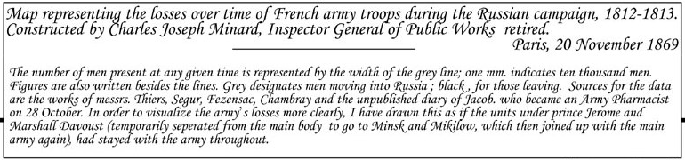

<!-- Use 
knitr::purl("tutorials/Minard.Rmd", output = "tutorials/", documentation = 2) 
to convert to an R file with text as 
     comments
-->

```{r setup, include=FALSE, purl=FALSE}
knitr::opts_chunk$set(echo = TRUE)
knitr::opts_chunk$set(
  warning = FALSE,   # avoid warnings and messages in the output
  message = FALSE,
  tidy.opts=list(width.cutoff = 120),  # For code
  options(width = 120)                 # for output
  )
```

```{r klippy, echo=FALSE, include=TRUE, purl=FALSE}
klippy::klippy()
```

## Goal

What would C. J. Minard have done if he had access to `R` and `ggplot2`? The goal of this excercise is to 
reproduce, to some reasonable approximation, Minard's famous graphic of Napoleon's March on Moscow.
Along the way, we'll learn some techniques for developing plots using `ggplot2`.

{width="70%"}

(The original source of this exercise was the documentation example for the Minard data,
`example("Minard", package="HistData")`, with the steps explained here.
Other ideas were taken from Andrew Heiss, [Exploring Minard's 1812 plot with ggplot2](https://github.com/andrewheiss/fancy-minard).)

(In this tutorial, you are encouraged to work it through in your own R session, using this file as a guide.
Each code chunk has an icon to copy the code to the clipboard. When a code chunk is hidden, click the **Show** button to un-hide it.)

This graph looks very complicated.  How should we get started?

## Data 

The first step is to **understand the available data**.

The data are contained in three data.frames in the [HistData]( https://CRAN.R-project.org/package=HistData) package.
Let's load each one and examine its structure.

#### Troops: `Minard.troops`
The main data on Napoleon's troop strength at points (`lat`, `long`) along the campaign path, giving the number of
`survivors`, stratified by `direction`, a factor with levels  `A` ("Advance") and `R` ("Retreat"),
and `group` (Napoleon had three generals commanding portions of his troops).

```{r data1}
data(Minard.troops, package="HistData")
str(Minard.troops)
```

#### Cities: `Minard.cities`
The (`lat`, `long`) locations of various places along the path of Napoleon's army, with the name of the `city`.

```{r data2, class.source = 'fold-hide'}
data(Minard.cities, package="HistData")
str(Minard.cities)
```

#### Temperature: `Minard.temp`
The temperature at various places along the march of retreat from Moscow, with their `date`.

```{r data3, class.source = 'fold-hide'}
data(Minard.temp, package="HistData")
str(Minard.temp)
```

## Analyzing the graph: layers

The first step is to try to decompose the graph in terms of the components to be plotted.

* First, the graph really consists of two separate plots, stacked vertically:

    + The graph of troop strength, with (x, y) coordinates (`lat`, `long`)
    + The graph of temperature, with coordinates (`temp`, `long`)

* The graph of troop strength has two layers:

    + A **path** connecting the (x, y) coordinates, of width proportional to `survivors`
    + **Text** labels on the map corresponding to the cities in `Minard.cities`

### Plotting the troops data

First, load the packages we will need.  In addition to `ggplot2` we will use the `scales` package to provide
convenient formatting of the scale for `survivors` and the `gridExtra` package to combine the two separate plots.

```{r load-packages}
library(ggplot2)
library(scales)        # additional formatting for scales
library(grid)          # combining plots
library(gridExtra)     # combining plots
library(dplyr)         # tidy data manipulations
```

The basic plot uses `lat` and `long` as the ggplot (x, y) coordinates. The line below just sets up an empty plot
frame for `lat` and `long`.

```{r eval=FALSE}
ggplot(Minard.troops, aes(long, lat)) 
```

The flow-map path of the surviving troops is a `geom_path` layer. The important aesthetic attribute is to map
the `size` (width) of the path to `survivors`. Here is a first try:

```{r Minard-troops1}
 ggplot(Minard.troops, aes(long, lat)) +
		geom_path(aes(size = survivors))
```

That is pretty hideous, but it is at least a first approxmiation.  What's wrong here:

* the path of Advance and Retreat are not distinguished in the graph.

* the aspect ratio of the plot doesn't reflect the equal scaling of degrees of latitude and longitude on a map,
or Minard's scaling in the graphic.

#### Try again

For the first problem, we need to map the color of the path to `direction`. In Minard's map, there are also some
side paths of parts of the army diverted to separate battles.  These are distinguished by the `group` variable.

The scaling of the horizontal and vertical axes is easily fixed by `coord_fixed()` which makes equal units appear
equal on the two axes.


```{r Minard-troops2}
 ggplot(Minard.troops, aes(long, lat)) +
		geom_path(aes(size = survivors, colour = direction, group = group)) +
    coord_fixed()
```

### Your turn

Before going further, here are some things to try:

* What if Minard simply made a line graph of the path, without using `survivors` as the size of the path?
What would he have gotten with just `geom_path()` -- no `size`, `color` or `group` aesthetics?

* What if Minard had added points (`+ geom_point(aes(size=survivors)`) to reflect the remaining size of the Grand Army?

* What if he also tried to distinguish the points by color, based on `direction` (`+ geom_point(aes(size=survivors, color=direction))`) ?

* In Minard's version, the two upward diversions of troops on the Retreat are drawn "behind" the path of the Advance, whereas in our version they appear in front.  How can we change this? (*Hint*: consider sorting the `Minard.troops` data or using *transparent* versions of the two colors.)


### Back to Minard

The graph above is correct geographically, but the vertical size is too small to accommodate other graphical
elements.
In the plots below, we omit `coord_fixed()`,
and use `knitr` options `fig.height=3.5, fig.width=10` to scale the plot in proportion to Minard's original.

As well, the individual segments of the path don't fit together very well and leave big gaps. We can fix that by adding a rounded line ending to each segment (`lineend="round"`).

#### Fixing the scales
`ggplot` automatically makes discrete categories for the `survivors` variable
and the values are printed in an unpleasant "e" (exponential) notation.
We can override the default using `scale_size()` providing our own `breaks`, and using `scales::comma()` to format the 
values.

While we're at it, we can also override the colors for the `direction` variable.  I used the Eyedropper tool in
Firefox **Tools -> Web Developer** to get the HEX values from the original graph.


```{r  Minard-troops3, fig.height=3.5, fig.width=10}
breaks <- c(1, 2, 3) * 10^5 
ggplot(Minard.troops, aes(long, lat)) +
		geom_path(aes(size = survivors, colour = direction, group = group),
		          lineend="round") +
    scale_size("Survivors", range = c(1,10), #c(0.5, 15),
               breaks=breaks, labels=scales::comma(breaks)) +
    scale_color_manual("Direction", 
                       values = c("#E8CBAB", "#1F1A1B"), 
                       labels=c("Advance", "Retreat")) 

plot_troops <- last_plot()
```
I'm also using a `ggplot` trick here:  I liked the result of this plot, so I can assign it to a variable, `plot_troops`
that I'll use later, rather than reproducing all the code each time. `last_plot()` always returns the last ggplot created or modified.

When we assemble this into the complete graphic, we might want to suppress the legends for `surviviors` and `direction`,
and perhaps also the axis labels (`lat` and `long`).
This is easy to do with `ggplot`, even though we saved this plot in a `ggplot` object.

#### Your turn

Before going further, here are some things to try:

* Open a copy of Minard's graphic, http://euclid.psych.yorku.ca/www/psy6135/images/Minard-march.png, in
a web browser or other application.  Find the color-picking tool that lets you hover the mouse on the graphic and
get the color values to use for the Advance and Retreat paths.

* When Minard combines this plot with others, he will want to make some adjustments.  Try some of the following:

    + Minard will not need the default labels and scales for the horizontal and vertical axes.
    Try running: `plot_troops + labs(x = NULL, y = NULL)`


    + Minard would not like the default ggplot theme, with a gray background and white grid lines. Try running:
    `plot_troops + theme_bw()`. There is a large collection of other themes, such as `theme_minimal()` and
    `theme_void()`.

    + He will also want to delete the legends for `survivors` and `direction`.  In `ggplot2`, these are
    handled by `guides()`, and we can set them to `"none"` to suppress them. 
    Try: `plot_troops + guides(color = "none", size = "none")`


### Cities

The locations of the cities in Minard's graphic provide the geographical context for this graphic story of Napoleon's terrible defeat. The cities he chose for the labels in the graph reflect important battles or other locations
from historical accounts of the 1812 campaign.
In `ggplot` terms, it is just another layer on the graph of the troops, added with `+`.

Using the `Minard.cities` data, we can use `geom_point()` to plot city locations, and/or `geom_text()` to plot their
names. If we use both, we have to figure out how to deal with overlap of points & text.

```{r Minard-cities1, fig.height=3.5, fig.width=10}
plot_troops + geom_text(data = Minard.cities, aes(label = city), size = 3)
```

Here is another version using both points and text labels for the cities. `geom_text()` has several other arguments
(`hjust`, `vjust`) to move the text away from the points, `angle` to print them at an angle, and
`family` to change the font family (e.g., `family = "Times New Roman"`)

```{r Minard-cities2, fig.height=3.5, fig.width=10}
plot_troops +	
	geom_point(data = Minard.cities) +
  geom_text(data = Minard.cities, aes(label = city), vjust = 1.5) 
```

Plotting both points and text labels is a common problem in graphics.  You often have to tweak the positions of the
labels so they don't overlap the points. A separate `ggplot`-compatible package, [ggrepel](https://CRAN.R-project.org/package=ggrepel) provides a function, 
`geom_text_repel()` to automatically move the labels away from points and to ensure none of the labels overlap.

```{r Minard-cities3, fig.height=3.5, fig.width=10}
if (!require(ggrepel)) {install.packages("ggrepel"); require(ggrepel)}
library(ggrepel)
plot_troops +	
	geom_point(data = Minard.cities) +
	geom_text_repel(data = Minard.cities, aes(label = city))

plot_troops_cities <- last_plot()
```
We like this version best, so we save it as `plot_troops_cities`.

## Plot of Temperature

The second plot in Minard's graphic is the plot of temperature against longitude on the path of the retreat.
Minard first takes a quick look at the data.

```{r}
Minard.temp
```

He then decides that this is just another `geom_path()`  His first version just adds the points.

In making this plot, I again measured the size of this part of the graph in Minard's original,
and used `fig.height=1.2, fig.width=10` as the `knitr` options in this chunk to make this plot have
approximately the right size and shape.

```{r Minard-temp1, fig.height=1.2, fig.width=10}
ggplot(Minard.temp, aes(long, temp)) +
	geom_path(color="grey", size=1.5) +
	geom_point(size=2) 
```

If you look carefully at Minard's graph, he labeled each point using the temperature and the date,
in the form $-26^o \textrm{le } 7 X^{bre}$ for the left-most point for December 7.
We construct a nicer `label` combining temperature and date as follows:


```{r}
Minard.temp <- Minard.temp %>%
	mutate(label = paste0(temp, "° ", date))
head(Minard.temp$label)
```
(There is one temperature in the data without a date. What R function could you use to change "NA" to " " in the code above?)

His next version of the plot of temperature used this `label` variable as follows:

```{r Minard-temp2, fig.height=1.2, fig.width=10}
ggplot(Minard.temp, aes(long, temp)) +
	geom_path(color="grey", size=1.5) +
	geom_point(size=1) +
  geom_text(aes(label=label), size=2, vjust=-1)
```

However, putting all the labels above the points gives the result that those for the right-most two points are
clipped, because they are outside the plot frame.
He tries this again, using `geom_text_repel()`:

```{r Minard-temp3, fig.height=1.2, fig.width=10}
ggplot(Minard.temp, aes(long, temp)) +
	geom_path(color="grey", size=1.5) +
	geom_point(size=1) +
  geom_text_repel(aes(label=label), size=2.5)
```

This is not too bad. He can always come back and tweak this later, assuming he saves his R code!

```{r save-plot_temp}
plot_temp <- last_plot()
```


## Assembling the graphic

OK, the pieces are done, and it is time to try to paste them together into a single graphic.
The tool for this is `grid.arrange()` from the [`gridExtra` package](https://CRAN.R-project.org/package=gridExtra).
Here is the first attempt, just placing one plot on top of the other, as is.

```{r arrange1, fig.height=4.7, fig.width=10}
grid.arrange(plot_troops_cities, plot_temp)
```

In the `knitr` options, I specified the final dimensions of the combined plot, `fig.height=4.7, fig.width=10`.
By defaut, `grid.arrange()` stacks them, and gives each the same vertical height.  We can fix this later.

First, let's fix the separate plots. In the plot of troops and cities, we need to:

* Set the X axis limits to a range that will coincide with those for the plot of temperature;
* Get rid of the X and Y axis labels scales;
* Remove the legends for `survivors` and `direction`;
* Get rid of all `ggplot2` theme elements.

```{r troops-cities-fixed, fig.height=3.5, fig.width=10}
plot_troops_cities +
  coord_cartesian(xlim = c(24, 38)) +
  labs(x = NULL, y = NULL) +
  guides(color = "none", size = "none") +
  theme_void()

plot_troops_cities_fixed <- last_plot()  
```

In the plot of temperature, we use similar techniques, however it takes a bit more work to suppress the
horizontal axis tick marks and labels. The `theme()` function allows all aspects of a graph to be
controlled.

```{r temp-fixed, fig.height=1.2, fig.width=10}
plot_temp + 
  coord_cartesian(xlim = c(24, 38)) +
  labs(x = NULL, y="Temperature") + 
  theme_bw() +
  theme(panel.grid.major.x = element_blank(),
        panel.grid.minor.x = element_blank(),
        panel.grid.minor.y = element_blank(),
        axis.text.x = element_blank(), axis.ticks = element_blank(),
        panel.border = element_blank())

plot_temp_fixed <- last_plot()
```

These plots are now both on the same horizontal scale.  To combine them in a single plot,
we can again use `grid.arrange()`.  It would be nice to add a border around the entire graphic.
The function `grid.rect()` in the `grid` package does this for us.

```{r arrange2, fig.height=4.7, fig.width=10}
grid.arrange(plot_troops_cities_fixed, plot_temp_fixed, nrow=2, heights=c(3.5, 1.2))
grid.rect(width = .99, height = .99, gp = gpar(lwd = 2, col = "gray", fill = NA))
```


## Going further

This is as far as we will take the reconstruction of Minard's graphic in this tutorial.  But,
here are some suggestions for going further.

* **Resizing and adding a title or descriptive text**:  My calculation of the height of the graphic
(3.5" for the plot of troops, 4.7" overall) did not take into account the top portion (about 0.64") 
that Minard devotes to the title and descriptive text. 

    + Re-do the map, making allowance for this.
    + Construct another graphic containing a title and some descriptive text.  An English translation of 
    Minard's text is contained in the image below.  You can use the `ggplot2` function `annotate()`
    for this, but that is quite tedious for lots of text.  Alternatively, find a way to read in this
    graphic and combine it with the image.



* **Fancy fonts**: Minard's original and the English translation ([originally from Tufte](https://www.edwardtufte.com/wp-content/uploads/2023/10/minard-napoleons-march-to-moscow-french-english.jpg))
use a fancy script font. To reproduce this aspect, the first task is to try to find a similar font.
Adobe has an [online font tool](https://fonts.adobe.com/fonts/); or, more conveniently,you can search 
[Google Fonts](https://fonts.google.com/), which fonts can be used with the `showtext` package.
I found something close in [Tangerine bold](https://fonts.google.com/specimen/Tangerine)


<br>

Here's a stub to get you started:
```{r eval=FALSE}
library(showtext)
font_add_google(name="Tangerine", family="tangerine")
showtext_auto()

title <- "Map of the losses over time of the French army during the Russian campaign, 1812-1813.\n
Constructed by Charles Joseph Minard, Inspector General of Public Works (retired). 
Paris, 20 November 1869."
```


* **Add a map background**:  Minard drew some map elements, largely rivers, on his graphic to provide more geographic context. The package [ggmap](https://CRAN.R-project.org/package=ggmap) works nicely with `ggplot2` and provides tools for getting map data from various web sources. Andrew Heiss, [Exploring Minard's 1812 plot with ggplot2](https://github.com/andrewheiss/fancy-minard) shows how to do this.

* **Re-visions of Minard**: My web page [Re-Visions of Minard](http://www.datavis.ca/gallery/re-minard.php) contains a collection of graphs that others have produced to either recreate Minard's graphic in other software or to attempt to display the data in some other way.  Study this page and try one or more of the ideas illustrated there.

